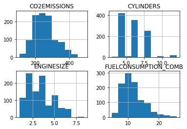
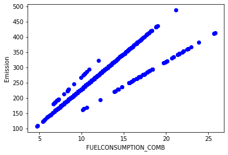
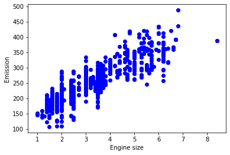
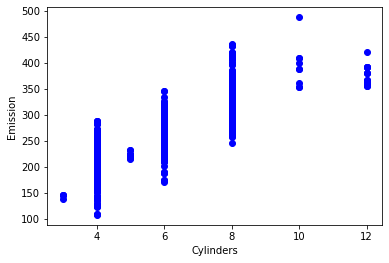
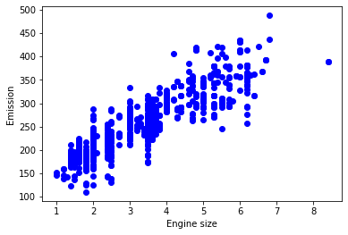
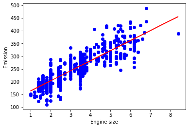

# <center>Regresión Simple Lineal</center>

Este es un set de datos relacionado al consumo de combustible y a la emisión del dióxido de Carbono en autos. Se separara en un set de entrenamiento y en otro set de prueba, crearemos un modelo utilizando un set de entrenamiento, se evaluará utilizando el set de prueba para finalmente usar el modelo para predecir valores desconocidos


### Importando paquetes Necesarios


```python
import matplotlib.pyplot as plt
import pandas as pd
import pylab as pl
import numpy as np
%matplotlib inline
```

### Descargando los Datos


```python
#!wget -O FuelConsumption.csv https://s3-api.us-geo.objectstorage.softlayer.net/cf-courses-data/CognitiveClass/ML0101ENv3/labs/FuelConsumptionCo2.csv
```

## Leyendo los datos


```python
df = pd.read_csv("FuelConsumption.csv")

# un vistazo dentro del set de datos
df.head(10)


```


<div>
<style scoped>
    .dataframe tbody tr th:only-of-type {
        vertical-align: middle;
    }

    .dataframe tbody tr th {
        vertical-align: top;
    }

    .dataframe thead th {
        text-align: right;
    }
</style>
<table border="1" class="dataframe">
  <thead>
    <tr style="text-align: right;">
      <th></th>
      <th>MODELYEAR</th>
      <th>MAKE</th>
      <th>MODEL</th>
      <th>VEHICLECLASS</th>
      <th>ENGINESIZE</th>
      <th>CYLINDERS</th>
      <th>TRANSMISSION</th>
      <th>FUELTYPE</th>
      <th>FUELCONSUMPTION_CITY</th>
      <th>FUELCONSUMPTION_HWY</th>
      <th>FUELCONSUMPTION_COMB</th>
      <th>FUELCONSUMPTION_COMB_MPG</th>
      <th>CO2EMISSIONS</th>
    </tr>
  </thead>
  <tbody>
    <tr>
      <th>0</th>
      <td>2014</td>
      <td>ACURA</td>
      <td>ILX</td>
      <td>COMPACT</td>
      <td>2.0</td>
      <td>4</td>
      <td>AS5</td>
      <td>Z</td>
      <td>9.9</td>
      <td>6.7</td>
      <td>8.5</td>
      <td>33</td>
      <td>196</td>
    </tr>
    <tr>
      <th>1</th>
      <td>2014</td>
      <td>ACURA</td>
      <td>ILX</td>
      <td>COMPACT</td>
      <td>2.4</td>
      <td>4</td>
      <td>M6</td>
      <td>Z</td>
      <td>11.2</td>
      <td>7.7</td>
      <td>9.6</td>
      <td>29</td>
      <td>221</td>
    </tr>
    <tr>
      <th>2</th>
      <td>2014</td>
      <td>ACURA</td>
      <td>ILX HYBRID</td>
      <td>COMPACT</td>
      <td>1.5</td>
      <td>4</td>
      <td>AV7</td>
      <td>Z</td>
      <td>6.0</td>
      <td>5.8</td>
      <td>5.9</td>
      <td>48</td>
      <td>136</td>
    </tr>
    <tr>
      <th>3</th>
      <td>2014</td>
      <td>ACURA</td>
      <td>MDX 4WD</td>
      <td>SUV - SMALL</td>
      <td>3.5</td>
      <td>6</td>
      <td>AS6</td>
      <td>Z</td>
      <td>12.7</td>
      <td>9.1</td>
      <td>11.1</td>
      <td>25</td>
      <td>255</td>
    </tr>
    <tr>
      <th>4</th>
      <td>2014</td>
      <td>ACURA</td>
      <td>RDX AWD</td>
      <td>SUV - SMALL</td>
      <td>3.5</td>
      <td>6</td>
      <td>AS6</td>
      <td>Z</td>
      <td>12.1</td>
      <td>8.7</td>
      <td>10.6</td>
      <td>27</td>
      <td>244</td>
    </tr>
    <tr>
      <th>5</th>
      <td>2014</td>
      <td>ACURA</td>
      <td>RLX</td>
      <td>MID-SIZE</td>
      <td>3.5</td>
      <td>6</td>
      <td>AS6</td>
      <td>Z</td>
      <td>11.9</td>
      <td>7.7</td>
      <td>10.0</td>
      <td>28</td>
      <td>230</td>
    </tr>
    <tr>
      <th>6</th>
      <td>2014</td>
      <td>ACURA</td>
      <td>TL</td>
      <td>MID-SIZE</td>
      <td>3.5</td>
      <td>6</td>
      <td>AS6</td>
      <td>Z</td>
      <td>11.8</td>
      <td>8.1</td>
      <td>10.1</td>
      <td>28</td>
      <td>232</td>
    </tr>
    <tr>
      <th>7</th>
      <td>2014</td>
      <td>ACURA</td>
      <td>TL AWD</td>
      <td>MID-SIZE</td>
      <td>3.7</td>
      <td>6</td>
      <td>AS6</td>
      <td>Z</td>
      <td>12.8</td>
      <td>9.0</td>
      <td>11.1</td>
      <td>25</td>
      <td>255</td>
    </tr>
    <tr>
      <th>8</th>
      <td>2014</td>
      <td>ACURA</td>
      <td>TL AWD</td>
      <td>MID-SIZE</td>
      <td>3.7</td>
      <td>6</td>
      <td>M6</td>
      <td>Z</td>
      <td>13.4</td>
      <td>9.5</td>
      <td>11.6</td>
      <td>24</td>
      <td>267</td>
    </tr>
    <tr>
      <th>9</th>
      <td>2014</td>
      <td>ACURA</td>
      <td>TSX</td>
      <td>COMPACT</td>
      <td>2.4</td>
      <td>4</td>
      <td>AS5</td>
      <td>Z</td>
      <td>10.6</td>
      <td>7.5</td>
      <td>9.2</td>
      <td>31</td>
      <td>212</td>
    </tr>
  </tbody>
</table>
</div>


### Exploración de Datos


```python
# Sumarizar los datos
df.describe()
```


<div>
<style scoped>
    .dataframe tbody tr th:only-of-type {
        vertical-align: middle;
    }

    .dataframe tbody tr th {
        vertical-align: top;
    }

    .dataframe thead th {
        text-align: right;
    }
</style>
<table border="1" class="dataframe">
  <thead>
    <tr style="text-align: right;">
      <th></th>
      <th>MODELYEAR</th>
      <th>ENGINESIZE</th>
      <th>CYLINDERS</th>
      <th>FUELCONSUMPTION_CITY</th>
      <th>FUELCONSUMPTION_HWY</th>
      <th>FUELCONSUMPTION_COMB</th>
      <th>FUELCONSUMPTION_COMB_MPG</th>
      <th>CO2EMISSIONS</th>
    </tr>
  </thead>
  <tbody>
    <tr>
      <th>count</th>
      <td>1067.0</td>
      <td>1067.000000</td>
      <td>1067.000000</td>
      <td>1067.000000</td>
      <td>1067.000000</td>
      <td>1067.000000</td>
      <td>1067.000000</td>
      <td>1067.000000</td>
    </tr>
    <tr>
      <th>mean</th>
      <td>2014.0</td>
      <td>3.346298</td>
      <td>5.794752</td>
      <td>13.296532</td>
      <td>9.474602</td>
      <td>11.580881</td>
      <td>26.441425</td>
      <td>256.228679</td>
    </tr>
    <tr>
      <th>std</th>
      <td>0.0</td>
      <td>1.415895</td>
      <td>1.797447</td>
      <td>4.101253</td>
      <td>2.794510</td>
      <td>3.485595</td>
      <td>7.468702</td>
      <td>63.372304</td>
    </tr>
    <tr>
      <th>min</th>
      <td>2014.0</td>
      <td>1.000000</td>
      <td>3.000000</td>
      <td>4.600000</td>
      <td>4.900000</td>
      <td>4.700000</td>
      <td>11.000000</td>
      <td>108.000000</td>
    </tr>
    <tr>
      <th>25%</th>
      <td>2014.0</td>
      <td>2.000000</td>
      <td>4.000000</td>
      <td>10.250000</td>
      <td>7.500000</td>
      <td>9.000000</td>
      <td>21.000000</td>
      <td>207.000000</td>
    </tr>
    <tr>
      <th>50%</th>
      <td>2014.0</td>
      <td>3.400000</td>
      <td>6.000000</td>
      <td>12.600000</td>
      <td>8.800000</td>
      <td>10.900000</td>
      <td>26.000000</td>
      <td>251.000000</td>
    </tr>
    <tr>
      <th>75%</th>
      <td>2014.0</td>
      <td>4.300000</td>
      <td>8.000000</td>
      <td>15.550000</td>
      <td>10.850000</td>
      <td>13.350000</td>
      <td>31.000000</td>
      <td>294.000000</td>
    </tr>
    <tr>
      <th>max</th>
      <td>2014.0</td>
      <td>8.400000</td>
      <td>12.000000</td>
      <td>30.200000</td>
      <td>20.500000</td>
      <td>25.800000</td>
      <td>60.000000</td>
      <td>488.000000</td>
    </tr>
  </tbody>
</table>
</div>


Seleccionemos algunas características para explorar más en detalle.


```python
cdf = df[['ENGINESIZE','CYLINDERS','FUELCONSUMPTION_COMB','CO2EMISSIONS']]
cdf.head(9)
```


<div>
<style scoped>
    .dataframe tbody tr th:only-of-type {
        vertical-align: middle;
    }

    .dataframe tbody tr th {
        vertical-align: top;
    }

    .dataframe thead th {
        text-align: right;
    }
</style>
<table border="1" class="dataframe">
  <thead>
    <tr style="text-align: right;">
      <th></th>
      <th>ENGINESIZE</th>
      <th>CYLINDERS</th>
      <th>FUELCONSUMPTION_COMB</th>
      <th>CO2EMISSIONS</th>
    </tr>
  </thead>
  <tbody>
    <tr>
      <th>0</th>
      <td>2.0</td>
      <td>4</td>
      <td>8.5</td>
      <td>196</td>
    </tr>
    <tr>
      <th>1</th>
      <td>2.4</td>
      <td>4</td>
      <td>9.6</td>
      <td>221</td>
    </tr>
    <tr>
      <th>2</th>
      <td>1.5</td>
      <td>4</td>
      <td>5.9</td>
      <td>136</td>
    </tr>
    <tr>
      <th>3</th>
      <td>3.5</td>
      <td>6</td>
      <td>11.1</td>
      <td>255</td>
    </tr>
    <tr>
      <th>4</th>
      <td>3.5</td>
      <td>6</td>
      <td>10.6</td>
      <td>244</td>
    </tr>
    <tr>
      <th>5</th>
      <td>3.5</td>
      <td>6</td>
      <td>10.0</td>
      <td>230</td>
    </tr>
    <tr>
      <th>6</th>
      <td>3.5</td>
      <td>6</td>
      <td>10.1</td>
      <td>232</td>
    </tr>
    <tr>
      <th>7</th>
      <td>3.7</td>
      <td>6</td>
      <td>11.1</td>
      <td>255</td>
    </tr>
    <tr>
      <th>8</th>
      <td>3.7</td>
      <td>6</td>
      <td>11.6</td>
      <td>267</td>
    </tr>
  </tbody>
</table>
</div>


podemos dibujar cada una de estas características:


```python
viz = cdf[['CYLINDERS','ENGINESIZE','CO2EMISSIONS','FUELCONSUMPTION_COMB']]
viz.hist()
plt.show()
```





Ahora, comparemos estas características anteriores con la emisión de carbono, para ver cuán lineal es la regresión:


```python
plt.scatter(cdf.FUELCONSUMPTION_COMB, cdf.CO2EMISSIONS,  color='blue')
plt.xlabel("FUELCONSUMPTION_COMB")
plt.ylabel("Emission")
plt.show()
```





```python
plt.scatter(cdf.ENGINESIZE, cdf.CO2EMISSIONS,  color='blue')
plt.xlabel("Engine size")
plt.ylabel("Emission")
plt.show()
```





```python
plt.scatter(cdf.CYLINDERS, cdf.CO2EMISSIONS, color='blue')
plt.xlabel("Cylinders")
plt.ylabel("Emission")
plt.show()


```





#### Creando el set de datos de entrenamiento y de el prueba


```python
msk = np.random.rand(len(df)) < 0.8
#print(msk)
train = cdf[msk]
test = cdf[~msk]
print(train)
#print("\n")
print(test)
```

          ENGINESIZE  CYLINDERS  FUELCONSUMPTION_COMB  CO2EMISSIONS
    0            2.0          4                   8.5           196
    2            1.5          4                   5.9           136
    4            3.5          6                  10.6           244
    5            3.5          6                  10.0           230
    7            3.7          6                  11.1           255
    ...          ...        ...                   ...           ...
    1060         3.0          6                  11.5           264
    1062         3.0          6                  11.8           271
    1063         3.2          6                  11.5           264
    1064         3.0          6                  11.8           271
    1066         3.2          6                  12.8           294
    
    [818 rows x 4 columns]
          ENGINESIZE  CYLINDERS  FUELCONSUMPTION_COMB  CO2EMISSIONS
    1            2.4          4                   9.6           221
    3            3.5          6                  11.1           255
    6            3.5          6                  10.1           232
    20           2.0          4                  10.0           230
    21           2.0          4                   9.3           214
    ...          ...        ...                   ...           ...
    1053         2.0          4                  10.7           246
    1055         3.0          6                  10.4           281
    1059         3.2          6                  10.2           235
    1061         3.2          6                  11.2           258
    1065         3.2          6                  11.3           260
    
    [249 rows x 4 columns]


### Modelo de Regresión Simple
La Regresión Lineal cuadra con un modelo lineal de coeficientes B = (B1, ..., Bn) para minimizar la 'suma residual de cuadrados' entre la x independiente del dataset y la dependiente y por la aproximación lineal.


```python
plt.scatter(train.ENGINESIZE, train.CO2EMISSIONS,  color='blue')
plt.xlabel("Engine size")
plt.ylabel("Emission")
plt.show()
```





#### Modeling
Usando el paquete sklearn para modelar datos.


```python
from sklearn import linear_model
regr = linear_model.LinearRegression()
#print(regr)
train_x = np.asanyarray(train[['ENGINESIZE']])
train_y = np.asanyarray(train[['CO2EMISSIONS']])
#print(train_x)
#print("\n")
#print(train_y)
#print("\n")

regr.fit (train_x, train_y)
#print(regr.fit)

# The coefficients
print ('Coefficients: ', regr.coef_)
print ('Intercept: ',regr.intercept_)
```

    Coefficients:  [[39.45219486]]
    Intercept:  [124.3190905]


#### Trazar las salidas

podemos marcar la recta de ajuste sobre los datos:


```python
plt.scatter(train.ENGINESIZE, train.CO2EMISSIONS,  color='blue')
plt.plot(train_x, regr.coef_[0][0]*train_x + regr.intercept_[0], '-r')
print(len(train_x))
plt.xlabel("Engine size")
plt.ylabel("Emission")
```

    818


    Text(0, 0.5, 'Emission')





#### Evaluación
Finalmente comparamos los valores actuales y predichos para calcular la exactitud del modelo de regresión. Las métricas de la evaluación proveen un rol principal en el desarrollo de un modelo, ya que provee conocimiento profundo en areas que necesitan mejoras.


```python
from sklearn.metrics import r2_score

test_x = np.asanyarray(test[['ENGINESIZE']])
test_y = np.asanyarray(test[['CO2EMISSIONS']])
test_y_ = regr.predict(test_x)

print("Error medio absoluto: %.2f" % np.mean(np.absolute(test_y_ - test_y)))
print("Suma residual de los cuadrados (MSE): %.2f" % np.mean((test_y_ - test_y) ** 2))
print("R2-score: %.2f" % r2_score(test_y_ , test_y) )
```

    Error medio absoluto: 25.04
    Suma residual de los cuadrados (MSE): 1012.55
    R2-score: 0.65

